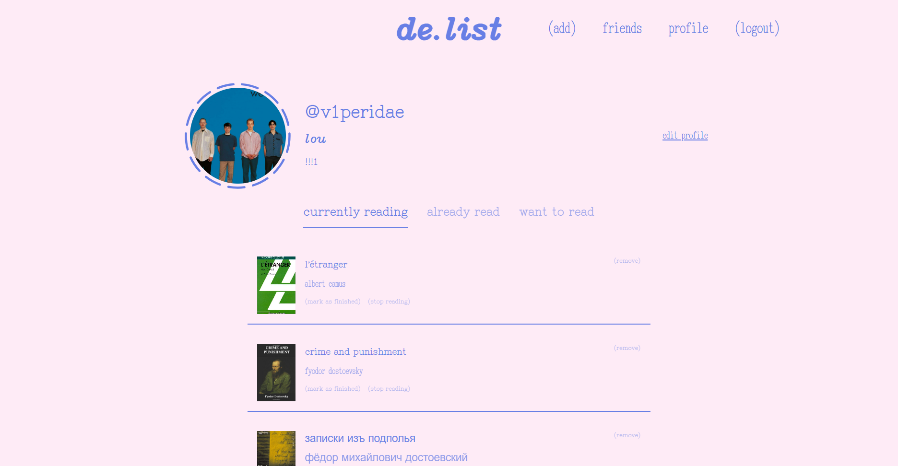
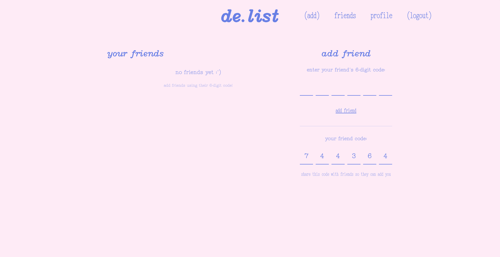
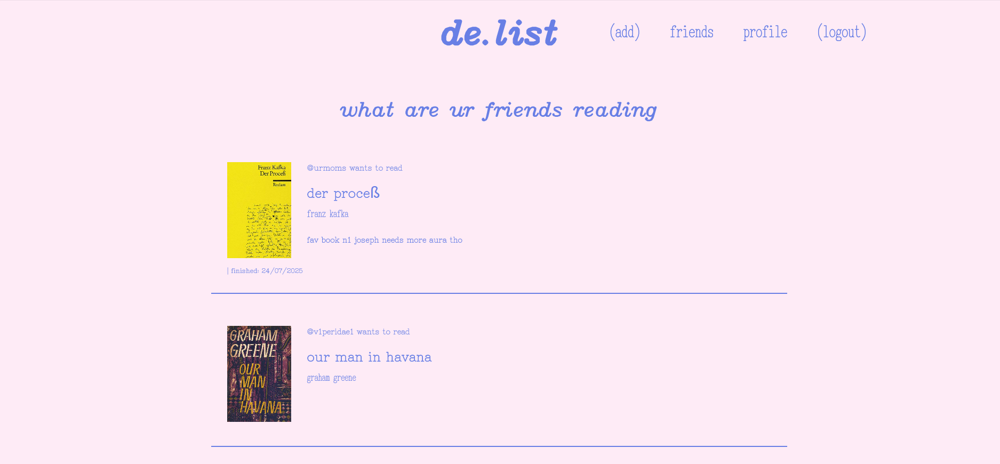

# de.list :)

link : https://delist.page  
repo : you're here

### are you someone who :

1. LOVES TO READ
2. DISLIKES GOODREADS
3. LOVES LETTERBOXD
4. MAY BE NOSEY

If you are any of the 4, I GOT YOU >:)

de.list is a chill app for yappers who enjoy to read where you can talk about YOUR faves, get to spy on what your friends are reading and keep track of what you're reading :)

i built it because i have a hard time using goodreads and i really wanted to do something special to do with books !

## you can

### have some pretty sick profile customisation :) 

### have a sick friend code !! pssst...please add me, i want friends! </3

> i did friend codes because they seem cool and someone needs to do the intentional act of giving you their friend code :)

### see what your friends are reading!!!

### nerd stuff?? :P

built with astro, react, tailwind 
postgres via prisma, my beloved 
firebase for auth

### if you wanna run it locally....

ngl idk how to direct you, im sorry :'). you could try:

1. you can clone this repo
2. `npm install`
3. `npm run dev`

### license

mit --i really do NOT care what you do <3

 

something you want to see or don't like? dm @lou on the hackclub slack, create an issue (or pr :P) or send a homing pigeon !

 

made with <3 and :3 by [@v1peridae](https://github.com/v1peridae)
